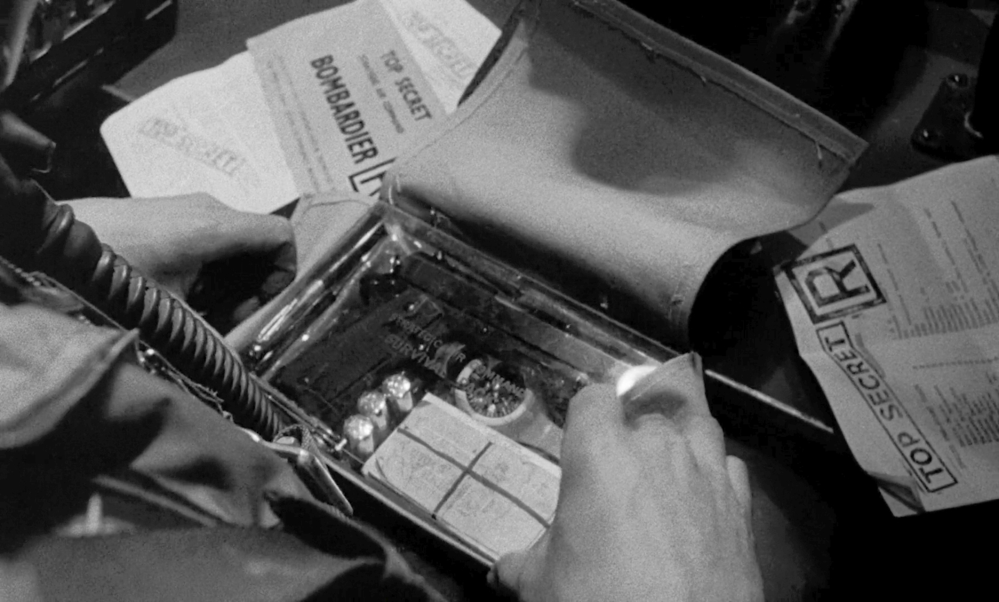

!SLIDE bullets incremental
# Resources
*  Learn the Hard Way: [bit.ly/learn-cli](http://bit.ly/learn-cli)
*  Topfunky's Prompt: [bit.ly/simple-zsh](http://bit.ly/simple-zsh)
*  Oh My ZSH!: [bit.ly/oh-my-zsh](http://bit.ly/oh-my-zsh)
*  My dotfiles: [bit.ly/chris-zsh](http://bit.ly/chris-zsh)

!SLIDE no-margin center

  Thanks!
  

  codeography.com
  github.com/csexton
  @crsexton

