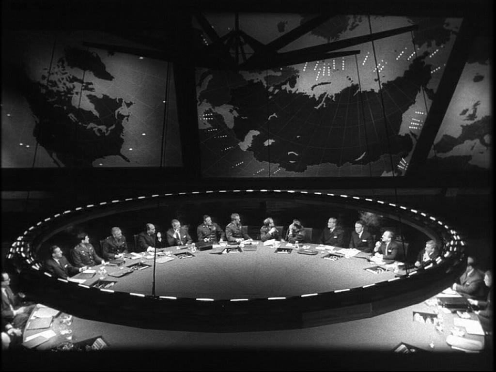

!SLIDE center no-margin

!SLIDE
# How I learned to Stop Worrying and Love the Command Line

!SLIDE
# The command line is awesome

!SLIDE
# Really Awesome

!SLIDE
# You just need a few building blocks

!SLIDE
## Key Concept
# Commands are high level functions

!SLIDE
## Key Concept
# All the input/output is text&#42;
 

!SLIDE
## Key Concept
# All the input/output is text&#42;
&#42; Mostly

!SLIDE
## Key Concept
# All the input/output is text&#42;
This is huge

!SLIDE
# Both kinds of input
* Parameters
* Input
* Files

!SLIDE
# Multiple Commands on one line with
Use a semicolon to separate commands

!SLIDE
# Use a && to run a command if the previous command is successful

!SLIDE
# Every command returns a number
Zero is happy

!SLIDE
# Chaining commands together

!SLIDE
# The Mighty Pipe

!SLIDE center no-margin

!SLIDE commandline incremental
Take the output of the previous command and pass it into the next

    $ cat 01_slide.md | grep "Take the output"
    Take the output of the previous command and pass it into the next

!SLIDE
# Seizing control

!SLIDE
# Signals and control characters
How to tell a process what's going on

!SLIDE
# Stop Temporarily
### SIGTSTP
### Control-Z

!SLIDE
# Quit and dump memory
### SIGQUIT
### Control-\

!SLIDE
# Interrupt
### SIGINT
### Control-C

!SLIDE
# end-of-transmission character
### EOT
### Control-D

!SLIDE bullets incremental
# Learning More
* man
* Usage
* -h/--help
* Tab Completion

!SLIDE
# Discoverability

!SLIDE
# Interopability

!SLIDE
#Automation

!SLIDE
#Does one thing and does it well

